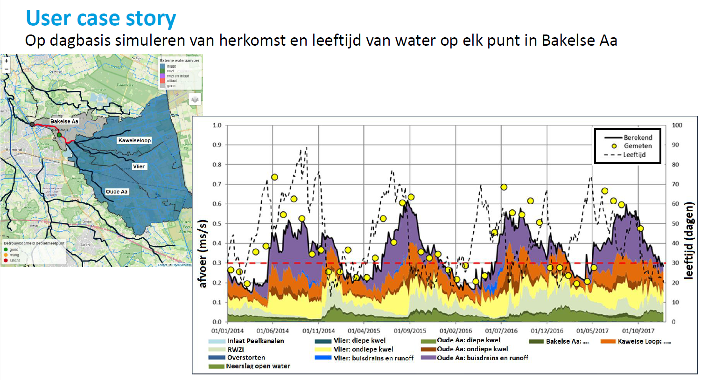

# ribasim_delwaq_aam

Ribasim-Delwaq workflow voor waterschap Aa en Maas.

## Doel



Deze repository bevat:
- projectconfiguratie voor de Python-omgeving met Pixi;
- generieke hulpmiddelen in `src/ribasim_tools`;
- workflowscripts in `scripts/` voor het knippen, forceren, controleren en plotten van het model.

## `.env` aanmaken

De projectinstellingen worden ingelezen via `src/ribasim_tools/ribasim_tools/settings.py`. Daarbij wordt automatisch gezocht naar een `.env`-bestand in de repository-root of een bovenliggende map.

Maak in de root van deze repository een bestand `.env` aan met minimaal deze variabelen:

```env
SOURCE_DATA_DIR=D:\repositories\ribasim_delwaq_aam\source_data
PROCESSED_DATA_DIR=D:\repositories\ribasim_delwaq_aam\processed_data
RIBASIM_HOME=D:\tools\ribasim
RUN_DIMR_BAT=C:\Program Files\Deltares\D-HYDRO Suite 2025.02 1D2D\plugins\DeltaShell.Dimr\kernels\x64\bin\run_dimr.bat
```

Betekenis van de variabelen:
- `SOURCE_DATA_DIR`: map met brondata en het oorspronkelijke model, zoals `lhm_aam/AaenMaas_2026_4_0/aam.toml`.
- `PROCESSED_DATA_DIR`: map waarin afgeleide modellen, tussenresultaten en uitvoer worden weggeschreven.
- `RIBASIM_HOME`: map waarin de Ribasim executable en bijbehorende runtime staan.
- `RUN_DIMR_BAT`: volledig pad naar `run_dimr.bat` uit een lokale D-HYDRO installatie.

Als een variabele niet in `.env` staat, gebruikt `settings.py` deze defaults:
- `source_data_dir`: `<repo>/source_data`
- `processed_data_dir`: `<repo>/processed_data`
- `ribasim_home`: `ribasim`
- `run_dimr_bat`: `c:\Program Files\Deltares\D-HYDRO Suite 2025.02 1D2D\plugins\DeltaShell.Dimr\kernels\x64\bin\run_dimr.bat`

## Directorystructuur

Deze paden in de `settings.source_data_dir` heb je nodig om alle scripts te kunnen draaien:

```text
source_data/
|-- afvoermetingen/
|   `-- OPP_discharge_2020_now.csv
|-- GRAM3_2/
|   `-- 100/
|       `-- GRAM32_BASIS1_TA-PRJ/
|           `-- RESULTS/
|               `-- BASIS1_TA-PRJ/
|                   |-- BDGDRN/
|                   |-- BDGRIV/
|                   `-- MSWAPINPUT/
|-- hsa_model/
|   `-- ribasim.toml
|-- lhm_aam/
|   `-- AaenMaas_2026_4_0/
|       `-- aam.toml
`-- shp/
    `-- subcatchments_Bakelse_Aa.shp
```

Bestanden en mappen onder `source_data/` die in de scripts daadwerkelijk worden ingelezen:

- `lhm_aam/AaenMaas_2026_4_0/aam.toml`
  Gebruikt in `scripts/1_knippen_LHM_AAM.py` via `settings.LHM_AAM_toml_path` als bronmodel voor het knippen.
- `shp/subcatchments_Bakelse_Aa.shp`
  Gebruikt in `scripts/1_knippen_LHM_AAM.py` en `scripts/2_ribasim_delwaq_LHM_BA.py` als begrenzing van het studiegebied en voor koppeling aan deelstroomgebieden.
  Let op: dit is een shapefile-set; de bijbehorende bestanden zoals `.dbf`, `.shx` en `.prj` moeten ook aanwezig zijn.
- `GRAM3_2/100/GRAM32_BASIS1_TA-PRJ/RESULTS/BASIS1_TA-PRJ/`
  Gebruikt in `scripts/2_ribasim_delwaq_LHM_BA.py` als root voor GRAM/MODFLOW- en MetaSWAP-budgetbestanden.
  Binnen deze map verwacht het script in elk geval de submappen `BDGDRN`, `BDGRIV` en `MSWAPINPUT`.
- `GRAM3_2/100/GRAM32_BASIS1_TA-PRJ/RESULTS/BASIS1_TA-PRJ/MSWAPINPUT/`
  Gebruikt in `scripts/2_ribasim_delwaq_LHM_BA.py` voor MetaSWAP-budgetten, met daarin onder meer de datasets `bdgPssw` en `bdgqrun`.
- `afvoermetingen/OPP_discharge_2020_now.csv`
  Gebruikt in `scripts/3_plotten_fracties.py` als meetreeks voor vergelijking met gesimuleerde afvoer.
- `hsa_model/ribasim.toml`
  Gebruikt in `scripts/debug_hsa/1a_sanitize_model.py` als bronmodel voor de HSA-debugworkflow.
- `hsa_model/`
  De HSA-debugworkflow leest niet alleen `ribasim.toml`, maar ook de bestanden waar dat model relatief naar verwijst, zoals de gekoppelde database en eventuele forcingbestanden in dezelfde modelmap.

De belangrijkste paden onder `settings.processed_data_dir`:

```text
processed_data/
|-- lhm_aam/
|   |-- LHM_BA/
|   |   `-- LHM_BA.toml
|   `-- LHM_BA_RVW/
|       |-- LHM_BA.toml
|       `-- delwaq_output/
`-- hsa_model/
    `-- HSA_BA/
```

## Starten in VS Code

We gebruiken Pixi binnen VSCode:
1. Installeer Pixi: <https://pixi.sh/dev/installation/>.
2. Open deze repository lokaal.
3. Start VS Code via `open-vscode.cmd`.
4. Wacht tot Pixi de environment in `.pixi\envs\default` heeft opgebouwd.
5. Accepteer de aanbevolen extensies, in elk geval `ruff`, zodat formatting en linting voor iedereen gelijk zijn.

De bedoeling van `open-vscode.cmd` is dat VS Code direct de juiste interpreter en projectomgeving gebruikt.

## Scripts draaien

De workflowscripts staan beschreven in [`scripts/README.md`](scripts/README.md). Gebruik die map als inhoudelijke index van de workflow en deze root-`README.md` voor de projectinrichting en omgeving.

Gebruikelijke werkwijze:
1. Start de repository via `open-vscode.cmd`.
2. Controleer of `.env` goed staat en of `source_data` en `processed_data` beschikbaar zijn.
3. Open het gewenste script in `scripts/`.
4. Draai het script vanuit VS Code of vanuit een terminal in de Pixi-environment.

De scripts in `scripts/` zijn oplopend genummerd en vormen samen de workflow:
- `1_knippen_LHM_AAM.py`: knipt het bronmodel naar het werkgebied.
- `2_ribasim_delwaq_LHM_BA.py`: voegt forcering, budgetten en Delwaq-stappen toe.
- `3_controle_MFMS_budgetten.py`: vergelijkt Ribasim-reeksen met MFMS/iMOD-budgetten.
- `3_plotten_fracties.py`: plot fracties en controle-uitvoer.

Als je de scripts handmatig vanaf de terminal draait, doe dat vanuit de repository-root zodat imports en relatieve paden consistent blijven.
